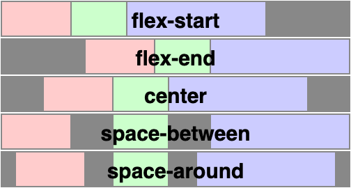
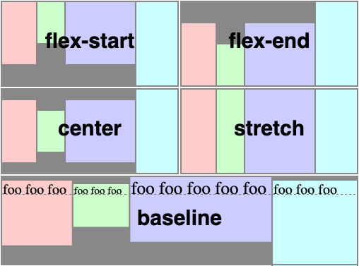

# Flexbox

**Resources**:
* [A guide to flexbox](https://css-tricks.com/snippets/css/a-guide-to-flexbox/)
* [Learn Flexbox in 15 minutes](https://www.youtube.com/watch?v=fYq5PXgSsbE&ab_channel=WebDevSimplified)
* [A great video to learn flexbox](https://www.youtube.com/watch?v=u044iM9xsWU&ab_channel=KevinPowell)

**Table of Contents**:
- [Terms](#terms)
- [Part 0 - Explore Flexbox on Youtube](#part-0---explore-flexbox-on-youtube)
- [Part 1 - Flex Containers and Flex Items](#part-1---flex-containers-and-flex-items)
- [Part 2 - Demo Styling a Navbar using Flexbox Container Properties](#part-2---demo-styling-a-navbar-using-flexbox-container-properties)
- [Part 3 - Flexbox Main and Cross Axes](#part-3---flexbox-main-and-cross-axes)
  - [Justify Content](#justify-content)
  - [Align Items](#align-items)
  - [Flex Direction](#flex-direction)
- [Part 4 - Growing and Shrinking](#part-4---growing-and-shrinking)
  - [Flex Wrap](#flex-wrap)
  - [Flex Grow](#flex-grow)
  - [Equal Columns](#equal-columns)
- [Part 5 - Examples!](#part-5---examples)

## Terms

* **Flexbox** - a `display` type that arranges flexible elements in rows (or columns)
* **Flex Container** - the element with `display:flex`. Its children are "flex items"
* **Flex Item** - an element inside of a flex container. It's size can flex based on the CSS settings of the flex container.
* **Main Axis** — the direction that flex items flow in
* **Cross Axis** — the direction perpendicular to the main axis
* The essential **flex container properties** are:
  * `justify-content` — defines alignment along the **main axis**
  * `align-items` — defines alignment along the **cross axis**
  * `gap` — controls spacing _between_ flex items (not on outer edges)
  * `flex-direction` - defaults to `row` but can be set to `column` to arrange flex items vertically.
* The essential **flex item properties** are:
  * `flex-grow` - defines the amount a flex item will grow relative to its siblings
  * `flex-shrink` - defines the amount a flex item will shrink relative to its siblings
  * `flex-basis` - defines the starting size of a flex item
  * `flex` - used as shorthand for the above 3 properties

## Part 0 - Explore Flexbox on Youtube

Open https://www.youtube.com/ and see how elements shift in size as you resize the window. 


**Q: Look at a row of video "cards". Are they `display:inline`, `display:block` or something else? Guess, then inspect the page!**

## Part 1 - Flex Containers and Flex Items

* Flexbox is used for **organizing children elements inside of a parent element**.
  * The parent element gets the `display: flex` propert, making it a **flex container**. 
  * The children of the flex container automatically become **flex items**


Flexbox does two things to a parent element: 
1. puts its children horizontally in a row (or vertically in a column)
2. makes those elements stretchy (we can control how much they stretch though!)


See how this is implemented in [`0-flexbox-demo/`](./lecture/0-flexbox-demo/)!

```css
/* Flex makes it easy to put things in a row with beautiful spacing */
.flex-container {
  display: flex;
  justify-content: space-between;
  gap: .5rem;
}

.flex-item {
  flex-grow: 1;
}

.flex-item:hover {
  flex-grow: 3;
}
```

## Part 2 - Demo Styling a Navbar using Flexbox Container Properties

One of the most common uses of flexbox is to style a navigation bar. Open up [`1-navbar`](./lecture/1-navbar/) and look at the `<header>` element:

```html
<!-- Often, the header contains a logo and a nav component -->
<header>
  <p id="header-logo">Ben's Blog</p>
  <nav>
    <!-- It is common to put a ul inside with links as list items -->
    <ul id="nav-links">
      <li><a href="#">Home</a></li>
      <li><a href="#">About</a></li>
      <li><a href="#">Contact</a></li>
    </ul>
  </nav>
</header>
```

Below, you can see what the header currently looks like (left) and what we want it to look like (right). What is different?


**Q: How do we fix this?**

* Most elements are `display: block` which means they are stacked on top of each other.
* We can apply `display: flex` to a parent element to put its children in a row horizontally

```css
header {
  display: flex; /* Makes the header a flex container */
  justify-content: space-between; /* main-axis spacing */
  align-items: center; /* cross-axis spacing */
}

ul {
  display: flex;
  gap: 1rem; /* increasing spacing between flex items */
}
```

* The essential **flex container properties** are:
  * `justify-content` — defines alignment along the **main axis**
  * `align-items` — defines alignment along the **cross axis**
  * `gap` — controls spacing _between_ flex items (not on outer edges)
  * `flex-direction` - defaults to `row` but can be set to `column` to arrange flex items vertically.


## Part 3 - Flexbox Main and Cross Axes

* Flexbox has two axes, the **main axis** and the **cross axis**


### Justify Content

* `justify-content` affects the positioning of flex items along the **main axis**



### Align Items

* `align-items` affects the positioning of flex items along the **cross axis**



### Flex Direction

* `flex-direction: column` changes the orientation of the main and cross axes. 
  * The main axis is now vertical
  * The cross axis is now horizontal

## Part 4 - Growing and Shrinking

The `flex-wrap`, `flex-basis` and `flex-grow` properties all control how flex items behave when space is limited.

### Flex Wrap

* By default, flex items will all try to fit onto one line.


```css
.container {
  flex-wrap: nowrap | wrap | wrap-reverse;
}
```

### Flex Grow

* `flex-grow` defines the ability for a flex item to grow if necessary. 


* It accepts a unitless value that serves as a proportion. 
* It dictates what amount of the available space inside the flex container the item should take up.

```css
.flex-item { flex-grow: 1 }
.flex-item:nth-child(2) { 
  flex-grow: 2
}
```

* If all items have flex-grow set to 1, the remaining space in the container will be distributed equally to all children. 
* If one of the children has a value of 2, that child would take up twice as much of the space either one of the others (or it will try, at least).

### Equal Columns

* To achieve equal columns, we need to ensure that each flex item starts with the same size (`flex-basis: 0%`) and will grow/shrink at the same rate (`flex-grow: 1` and `flex-shrink: 1`).

```css
.flex-item {
  flex-grow: 1;
  flex-shrink: 1;
  flex-basis: 0;
  /* flex: 1 1 0; */
  /* flex: 1; */
}
```

* The `flex` property can serve as a short-hand for all three: `flex: 1 1 0%`
* The default is `0 1 auto`, but if you set it with a single number value, like `flex: 5;`, that changes the `flex-basis` to `0%`, so it’s like setting `flex-grow: 5; flex-shrink: 1; flex-basis: 0%;`.

> `flex-basis` often causes confusion since it is similar (but different) from setting the `width` of each flex item.

## Part 5 - Examples!

* Check out the `3-photo-gallery/` directory for a cool example of using flexbox to make a wall-to-wall flexible photo gallery based on this post: [Adaptive Photo Layout With Flexbox](https://css-tricks.com/adaptive-photo-layout-with-flexbox/)
* [19 CSS Flexbox Examples](https://freefrontend.com/css-flexbox-examples/)